## 高通量 20160922
- 分子生物（molecular biology）
 	- deoxyribonucleic acid (DNA) 去氧核醣核酸 
 		- sugar（股狀）+ base鹼基（中間的階梯狀）
 		- base type：A/T/C/G
 			- 中間鍵結：A:T, C≡G
 		- 正意(sense) VS 反意(antisense)
 			- 當DNA要轉錄成RNA時
 			- sense strand:為mRNA(信使RNA)要複製的那段DNA序列片段
 			- anti-sense strand:由於DNA有互補性，故mRNA應沿著反意股複製，才能合成所需。
 	- ribonucleic acid (RNA) 核糖核酸
 		- 單股，生命週期短，較DNA不穩定，有時會成二級結構
 		- base type:A/U/C/G
 	- Protein 蛋白質
 		- 有三級、四級結構
 	- 中心法則：DNA製造RNA，RNA製造蛋白質，蛋白質反過來協助前兩項流程，並協助DNA複製。
 		- DNA -->(**transcription轉錄**)--> RNA -->(**translation轉譯**)--> protein *(真正做生化行為的部分)*
 		- RNA -->(**reverse transcription**)--> DNA，例如：愛滋病
 		- 
 		- Transcription
 			- DNA -> RNA
 			- 方向：5'端->3'端，被轉錄的那一股稱template strand；另一股稱coding strand，此序列和新產生的RNA序列相同（除U替代T)
 			- 大部分時間為染色質or絲chromatin(散亂狀)，當要進行轉錄時會和histone(組織蛋白)結合，纏繞成染色體chromosome(像X型)。
 			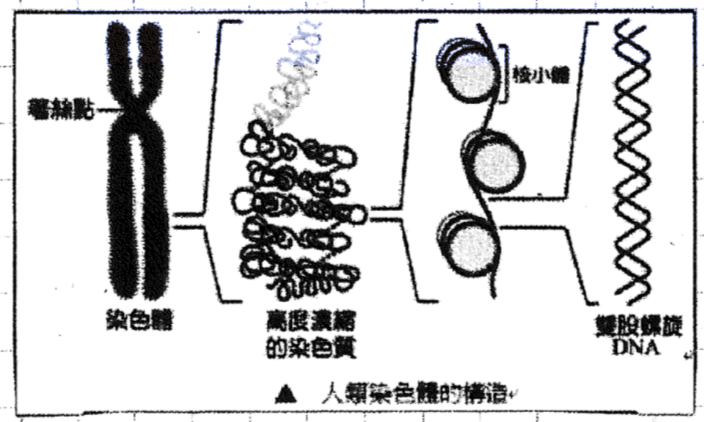
 			- DNA會纏繞在四對（共八個）histones組成核小體。
 				- 四對組織蛋白：H2A和H2B兩組、H3和H4兩組
 				- histone H1：負責連結兩個核小體之間的DNA
 				- histone：作為DNA纏繞的線軸，並在基因調控中發揮作用。
 				- Nucleosome 核小體：真核生物染色質（除了精子染色質外）的基本單位。
 			- RNA polymerase (RNA聚合酶, RNAP, RNApol)
 				- 負責從DNA或RNA模板製造RNA的酶，可分為：
 					- pol I:合成核糖體RNA (rRNA)的前體
 					- pol II:合成信使RNA (mRNA)的前體。它在轉錄過程中需多種轉錄因子才能和啟動子結合。
 					- pol III:合成轉運RNA (tRNA)及其他較小的RNA
 				- Transcription factor (轉錄因子, TF)：一個會和DNA bind的蛋白質。由於RNA聚合酶自身無法啟動轉錄，只有當TF結合在歧視別的DNA序列上後，基因才開始表達。
 				- promoter 啟動子：指一段能使基因進行轉錄的DNA序列，可被RNA聚合酶辨認，並開始轉錄。啟動子可和決定開始的TF產生相互作用，控制基因表現（轉錄）的起始時間和表現程度、繼而控制細胞開始生產哪一種蛋白質。
 				- enhancer 強化子：是DNA上一段可與蛋白質結合的區域，結合後基因的轉錄作用將加強。
 			- 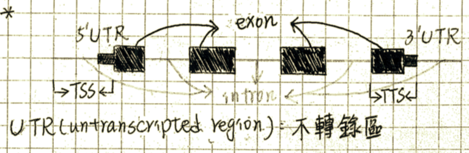
 				 - exon 外顯子：在轉錄並修飾後仍會被保留下來
 				 - intron 內插子：阻斷基因線型表現的序列，內插子會在RNA離開細胞核進行轉譯前被剪除
 			- mRNA加工（轉錄後修飾）：初期轉錄RNA(nascent RNA)需經三個修飾加工才能成熟。
 				1. 5'端加工：在5'端加上CAP，有保護作用。
 				2. 3'端加工：在3'端加上AA..A尾以保護。
 				3. splicing 剪接：將intron移除，及將exon拼接一起。
 			- Ribosome 核糖體：由rRNA和protein組成，是細胞內蛋白質合成的場所，負責完成中心法則中轉譯的工作。
 			- tRNA (Transfer RNA)：在轉譯時，攜帶特定的氨基酸到正在加上的多肽鏈的ribosomal site上。具一種髮夾(hair-pin)的結構，上頭攜帶一種氨基酸，下面有可和mRNA對應的地方，稱為anti-codon(反密碼子)。mRNA在酵素帶領下進入ribosome，接著3個base為一單位，和tRNA做比對。mRNA和tRNA在ribosome裡面轉譯出氨基酸鏈。
 				- 多肽鏈：合成蛋白質時，根據遺傳密碼將氨基酸依序連接成多肽鏈，再經由折疊、組合成具有特定構造與功能的蛋白質。蛋白質可以是一條或多條多肽鏈組合而成。
 	- 中央極限定理(Central Litmit Theorem)：在適當的條件下，大量相互獨立隨機變數的均值經適當標準化後依分佈收斂於常態分佈。
 	- z-test VS t-test
 		- type | t-test | z-test
 			----  | ----    | ----
 			meaning| to identify how the means of two sets of data differ from one another when variance is not given | a hypotheses test which ascertains if the means of two datasets are different from each other when variance is given
 			population variance | unknown | known
 			sample size | small | large
 	- others mentioned
 		- transposon: 又稱為跳躍基因，是一段DNA序列，其中有重複的序列，故結構不穩定。它可以從染色體DNA上單獨複製或斷裂，自己形成一個圈環保持結構的穩定，接著再插入其他染色體DNA序列中，影響其他位置的基因調控功能（可能發生於基因改變或重組）。
 			- type
 				- retrotransposon: 會先變成RNA，再製造產生出一份DNA序列之後 (複製)，再插入到其他基因序列中。（複製-貼上)
 				- DNA transposon: 直接插入其他基因序列。（剪下-貼上)

----

## 高通量 20160929
- Probability 機率
	- Random Variable 隨機變數 (通常為大寫字母)
		- def: A numerical property that varies every time you experiment/try/measure it in *a pool* (Union).
		- U 宇集：a set of all possible outcome of the experiments
		- Event 事件：a subset of U (通常為小寫字母)
	- probability = approximention
	- def: A metric to qualify the chance that a specific event will happen/is true.

- Likelihood
	- 不同於機率。其為「在給定資料下，參數是某個值的強度」或「當參數是某個值的時候我們抽樣出這樣資料的機率」。
	- how likely the parameter(Θ) leads to the observed outcome
	- 和可以不為1
	- Maximal Likelihood Estimator (MLE) 最大似然估計
		1. f(X|θ), θ 為未知
		2. 求可以讓 L(θ) 最大化的 θ 參數 θ^
		3. 用 θ^ 取代 θ ，就可得到最大慨似估計式。
- Distribution 分佈
	- The aggregate of the probability of each outcome of the random variable.
	- discrete
		- PMF (Probability Mass Function)：離散隨機變量在各特定取值上的機率。
	- continuous
		- PDF (Probability Density Function):針對連續隨機變量所定義的，本身不是機率，只有對PDF在某區間內進行積分後才是機率。
		- CDF (Cumulative Distribution Function 累積分佈函數)：求特定變量下累加機率的函數。
	- 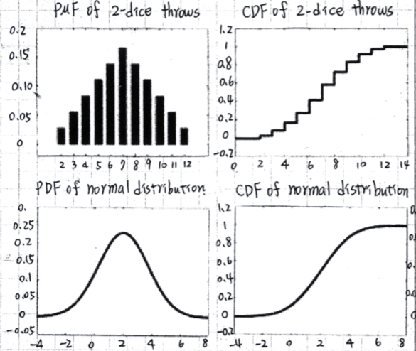
		- 連續型隨機變數的CDF斜率最大的地方，為PDF開始累積上升最高、值最大的區域。
		- 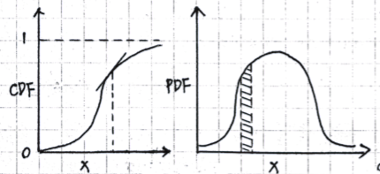
		- (上)PDF (下)CDF
			- 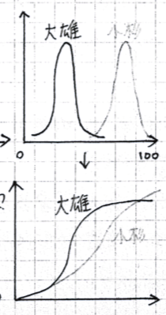
	- p-value：p-value越小，表示抽樣樣本越極端，越不可能出現。
		- The p-value always means the probability that the observed test statistic would be as extreme as observed, if the null hypothesis were true.
- Venn Diagram
	- def: describe the logical (and, or, xor) relationship among probability distribution.
	- example: 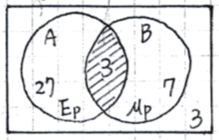
- Conditional Probability: 改變宇集至另一個event。P(A|B)表示在事件B發生的條件下，事件A發生的機率，其中「｜」唸作given，整體讀作「在B條件下A的機率」。
- Joint Probability: 兩個或兩個以上的事件，同時發生的機率。
	- **P(A,B)=P(A|B)・P(B)**
- Independent event：A事件的發生不影響B事件發生的機率，則Ａ、Ｂ為獨立事件。故即使改變宇集至另一個事件，機率依舊不變。
	- P(A,B)=P(A|B)・P(B)=P(B)・P(A)
	- 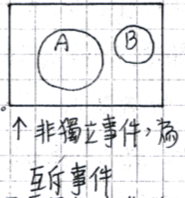
- Chain Rule
	- P(A, B, C, ..., Z) = P(A|B,C,...,Z)・P(B,C,...,Z)
	= P(A|B,C,...,Z)・P(B|C,...,Z)・P(C,D,...,Z)
	= P(A|B,C,...,Z)・P(B|C,...,Z)・P(C,D,...,Z)・...・P(Y|Z)・P(Z)
- Bayes' theorem
	- P(A|B) = P(B|A)・P(A)/ P(B)
		- P(A,B) = P(A|B)・P(B) = P(B|A)・P(A)
		- 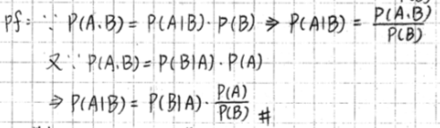 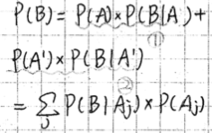
	- 預測參數Θ (有不確定性，非機率，沒有隨機性)
		- P(Θ|B) = P(Θ)・P(B|Θ) / P(B)
			- P(Θ):prior, P(B|Θ):likelihood, P(B):marginal, P(Θ|B): posterior
			- 舉例：欲預測P(甲得某病|甲突變) = P(全人類得此病)・P(突變|得病) / P(突變)
			- 藉由其他資訊(*全人類得病的機率*)來補足未知的部分(*甲得病的機率*)，再預測我們要的參數。
- Naive Bayes Classifier
	- 問題描述：給定由屬性A1, A2, ..., An和類別C1, C2組成的training data。求任n種Ａ組合的情況下，應被分類到C1還是C2。
	- 解決辦法：比較P(C1|A1,...,An)和P(C2|A1,...,An)，若前者較高，就將(A1,...,An)分類到C1。
	- 原理說明：若training data未出現(A1,...An)的組合，Naive Bayes Classifier亦可估計P(C1|A1,...,An)和P(C2|A1,...,An)何者較高，因為Naive Bayes Calssifier假設所有屬性對其類別具有conditional independence，故P(C1|A1,...,An)可拆為：P(A1,...,An|C1) = P(A1|C1)・P(A2|C1)・...・P(An|C1)。
	- 真實情況下，conditional independence不一定成立。

----

## 高通量 20161006
- Shannon Entropy (information)
	- Entropy：「熵」，亂度。熵是對某個系統之不確定性或混亂程度的度量方式。數字越大越亂。
		- def: Entropy H(X) is the uncertainty of a single random variable
	- uncertainty 不確定性：-log(P)
	- 公式：求uncertainty的期望值
		- 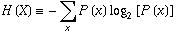，底數可不為2
	- 當機率越平均時，即事件機率越均勻、越無法預測，不確定性最高，訊息熵最大。
	- sequence logo:會由Position-Specific Scoring Matrix(PSSM)或稱Position-Specific Frequency Matrix(PSFM)畫出
		- A sequence logo is a graphical representation of the sequence conservation of nucleotides or amino acids. 序列標誌以圖形化的方式來代表相對頻率、資訊內容、取代偏好的次序、以及在排比中各個位置上的其他特性等。
		- 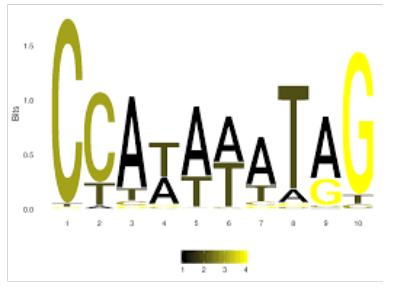
		- [introduction to PFM/PPM](http://yaoyao.codes/biology/2017/02/05/pwm-pssm-sequence-logo)

- Information Gain
	- 測試Y有無因X資訊而改變
	- 公式：I(Y;X) = H(Y) - H(Y|X)，分類前的資訊量-分類後的資訊量
		- Conditional Entropy
			- 寫作H(Y|X)
			- def: the entropy of one random variable *conditional upon* knowlege of another.
			- 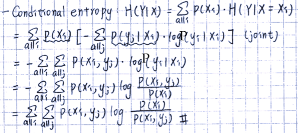
			- H(Y|X) != H(X|Y)

- Multiple EM for Motif Elicitation (MEME)
	- motif: A sequence pattern that occurs repeatedly in a group of related protein or DNA sequences and is often associated with some biological function.
	- From a biological point of view, MEME identifies and characterizes shared motifs in a set of unaligned sequences. 
	- From the computer science aspect, MEME finds a set of non-overlapping, approximately matching substrings given a starting set of strings.
	- [MEME wiki](https://en.wikipedia.org/wiki/Multiple_EM_for_Motif_Elicitation)

- Relative Entropy
	- H(P||Q) = ΣP(Xi)・log(P(Xi)/Q(Xi))
	- [c.f.] conditional entropy -> H(Y|X) = 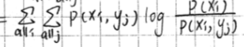

- Mutual Information (MI)
	- 代表兩個隨機變數間共有的訊息位元數（關聯性），相當於隨機變數Ｘ的熵與conditional entropy H(X|Y)之間的差。
	- compared w/ Pearson Correlation, Spearson Correlation
	- 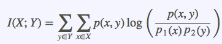
	- 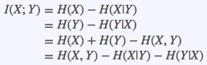
	- MI越大，代表關聯性越強；若隨機變數X與Ｙ無關（條件獨立），則mutual information將會為0。

- Likelihood
	- [previous content](#likelihood-bookmark)

- Expectation-Maximization(EM) algorithm 期望值最大化
	- *參考Machine Learning 最後一堂課*
