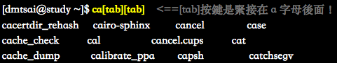
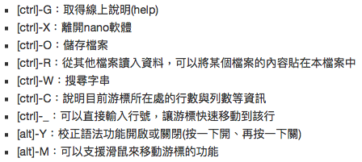

## Linux

- Resource
	- [鳥哥的Linux私房菜](http://linux.vbird.org/new_linux.php)
- Linux基礎文件
	- 首次登入與線上求助
		- 文字模式下指令
			- 快捷鍵
				- [Tab] 
					- 接在一串指令的第一個字後面，為「命令補全」。
					- 接在一串指令的第二個字以後，為「檔案補齊」。
					- 
				- [Ctrl]-c：中斷目前程式
				- [Ctrl]-d
					- 鍵盤輸入結束，意同End Of File, EOF, End Of Input，可以取代exit的輸入
					- 可直接離開文字介面
				- [shift]+{[PgUP]|[PgDown]}：翻頁
			- 求助
				- [--help] 舉例： date **--help**
				- man 舉例：**man** date
				- info 線上求助
		- 文書編輯器：nano
			- 快捷鍵
				- 
		- 常用指令
			- sync 資料同步寫入磁碟
			- shutdown 關機
			- reboot, halt, poweroff
	- 檔案權限與目錄配置