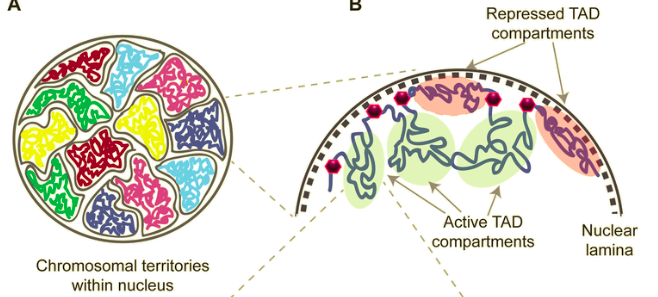

##### Forces driving the three-dimensional folding of eukaryotic genomes

## Topologically associating domain (TAD) 拓墣相關結構率
- DNA sequences within a TAD physically interact with each other more frequently than with sequences outside the TAD.
- 這一區是一個「作用」的單位。（這區域專門在做某件事）
- 染色體不會全部交纏在一起，故可以*Hi-C*等技術分析他們的聚集/分隔狀況而得TAD。
	- Hi-C
- 
- TAD are demarcated by CTCF（哺乳類主要為這個）, active RNA polymerases, transcriptional activators, nascent RNA, or by transitions in chromatin compartments. (因為果蠅沒有CTCF的因子，所以找到其他除了CTCF可以形成TAD的因子)
	- CTCF與topoisomerase II,  RUNX1, BRD2, YY1或nuclear martix protein HNRNPU一起協助形成TAD。
- Cohesin & CTCF
	- 可以建構一個boundary，形成TAD
	- CTCF 抑制蛋白

- words mentioned
	- eukaryotic 真核生物
	- cell nuclei

----
#### Enhancing Hi-C data resolution with deep convolutional neural network HiCPlus

## Motivation
- Hi-C tech: A/B compartment(A: active, B: inactive), TADs, chromatin looops, frequently interacting regions(FIREs)

## Background
- Hi-C data are presented as an n\*n contact matrix, where the genome is divided into n equally sized bins
	- n: number of bins
- *Hi-C wiki [link](https://zh.wikipedia.org/wiki/染色体构象捕获#实验方法)*

## Model

